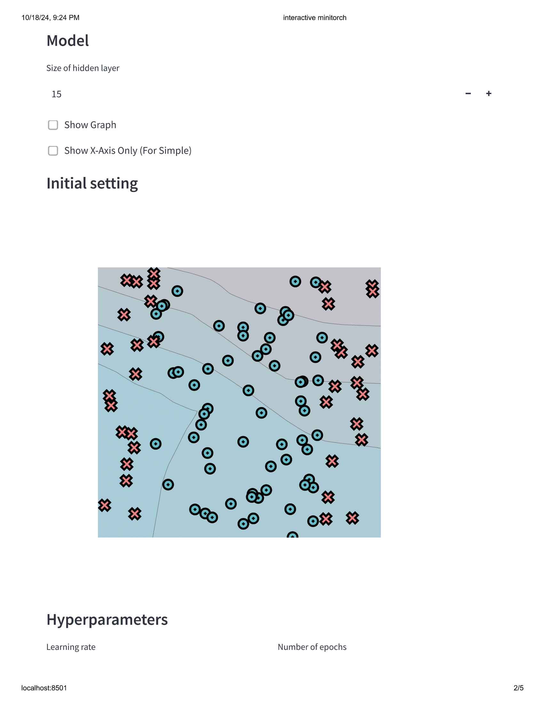
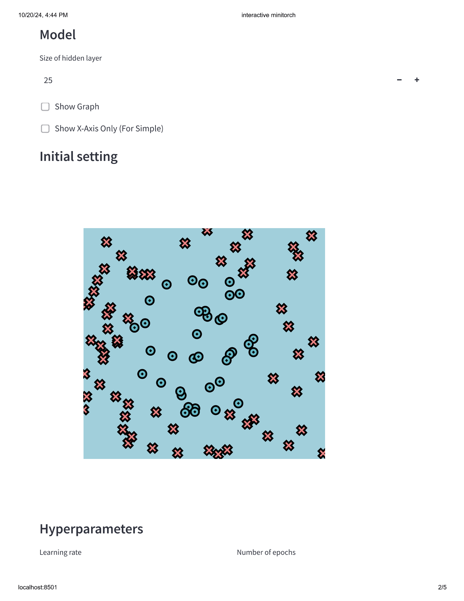

[](https://classroom.github.com/a/YFgwt0yY)
# MiniTorch Module 2


* Docs: https://minitorch.github.io/

* Overview: https://minitorch.github.io/module2/module2/

This assignment requires the following files from the previous assignments. You can get these by running

```bash
python sync_previous_module.py previous-module-dir current-module-dir
```

The files that will be synced are:

        minitorch/operators.py minitorch/module.py minitorch/autodiff.py minitorch/scalar.py minitorch/scalar_functions.py minitorch/module.py project/run_manual.py project/run_scalar.py project/datasets.py

## Simple Dataset


Epoch: 0/500, loss: 0, correct: 0
Epoch: 10/500, loss: 57.02536747628714, correct: 67
Epoch: 20/500, loss: 50.77013921003473, correct: 99
Epoch: 30/500, loss: 46.343878621224974, correct: 99
Epoch: 40/500, loss: 42.20979414002182, correct: 99
Epoch: 50/500, loss: 38.32256128223088, correct: 99
Epoch: 60/500, loss: 34.721512369558134, correct: 99
Epoch: 70/500, loss: 31.485838971806793, correct: 98
Epoch: 80/500, loss: 28.631449346499426, correct: 97
Epoch: 90/500, loss: 26.13523882049551, correct: 97
Epoch: 100/500, loss: 23.981061424709296, correct: 97
Epoch: 110/500, loss: 22.108482004555537, correct: 97
Epoch: 120/500, loss: 20.49234133879863, correct: 97
Epoch: 130/500, loss: 19.101993189868246, correct: 97
Epoch: 140/500, loss: 17.889318548275224, correct: 97
Epoch: 150/500, loss: 16.814685944901836, correct: 97
Epoch: 160/500, loss: 15.84452686611688, correct: 97
Epoch: 170/500, loss: 14.98345444971437, correct: 97
Epoch: 180/500, loss: 14.216441985840664, correct: 97
Epoch: 190/500, loss: 13.529262906493338, correct: 98
Epoch: 200/500, loss: 12.92508229496171, correct: 98
Epoch: 210/500, loss: 12.385054217297105, correct: 98
Epoch: 220/500, loss: 11.903633834110176, correct: 98
Epoch: 230/500, loss: 11.468727527002002, correct: 98
Epoch: 240/500, loss: 11.068909312215874, correct: 99
Epoch: 250/500, loss: 10.69994778046331, correct: 99
Epoch: 260/500, loss: 10.358525419295674, correct: 99
Epoch: 270/500, loss: 10.041404962209153, correct: 99
Epoch: 280/500, loss: 9.745882550582028, correct: 99
Epoch: 290/500, loss: 9.469588000418463, correct: 99
Epoch: 300/500, loss: 9.212966399644005, correct: 99
Epoch: 310/500, loss: 8.972326009912653, correct: 99
Epoch: 320/500, loss: 8.74572772073347, correct: 99
Epoch: 330/500, loss: 8.531982122752355, correct: 99
Epoch: 340/500, loss: 8.329789217200258, correct: 99
Epoch: 350/500, loss: 8.138177315960256, correct: 99
Epoch: 360/500, loss: 7.956338917289571, correct: 100
Epoch: 370/500, loss: 7.78352258180178, correct: 100
Epoch: 380/500, loss: 7.619105060239365, correct: 100
Epoch: 390/500, loss: 7.4624800938901865, correct: 100
Epoch: 400/500, loss: 7.313040597572444, correct: 100
Epoch: 410/500, loss: 7.170280874930964, correct: 100
Epoch: 420/500, loss: 7.033757420371992, correct: 100
Epoch: 430/500, loss: 6.903070925257194, correct: 100
Epoch: 440/500, loss: 6.777842303720587, correct: 100
Epoch: 450/500, loss: 6.6577878960297765, correct: 100
Epoch: 460/500, loss: 6.542511691505012, correct: 100
Epoch: 470/500, loss: 6.431729686010256, correct: 100
Epoch: 480/500, loss: 6.325225851084066, correct: 100
Epoch: 490/500, loss: 6.222678283197184, correct: 100
Epoch: 500/500, loss: 6.123844254017351, correct: 100

## Diagonal Dataset


Epoch: 0/850, loss: 0, correct: 0
Epoch: 10/850, loss: 61.93600811086275, correct: 96
Epoch: 20/850, loss: 48.28069031014731, correct: 86
Epoch: 30/850, loss: 42.85417259306675, correct: 86
Epoch: 40/850, loss: 39.813484631613, correct: 86
Epoch: 50/850, loss: 37.716247491669016, correct: 86
Epoch: 60/850, loss: 36.04330537253326, correct: 86
Epoch: 70/850, loss: 34.589586869710324, correct: 86
Epoch: 80/850, loss: 33.28400772052367, correct: 86
Epoch: 90/850, loss: 32.095134771506764, correct: 86
Epoch: 100/850, loss: 31.017903590130185, correct: 86
Epoch: 110/850, loss: 29.992305274817966, correct: 86
Epoch: 120/850, loss: 29.007468798206336, correct: 86
Epoch: 130/850, loss: 28.0474023334054, correct: 86
Epoch: 140/850, loss: 27.11139486357858, correct: 86
Epoch: 150/850, loss: 26.195661722549286, correct: 86
Epoch: 160/850, loss: 25.296656123486784, correct: 87
Epoch: 170/850, loss: 24.4200013649187, correct: 87
Epoch: 180/850, loss: 23.569069225011233, correct: 87
Epoch: 190/850, loss: 22.74549264027233, correct: 87
Epoch: 200/850, loss: 21.949607691463097, correct: 89
Epoch: 210/850, loss: 21.17808022230379, correct: 89
Epoch: 220/850, loss: 20.436649187948753, correct: 90
Epoch: 230/850, loss: 19.728574708975312, correct: 91
Epoch: 240/850, loss: 19.05319960766868, correct: 91
Epoch: 250/850, loss: 18.41046500381782, correct: 92
Epoch: 260/850, loss: 17.800498222172376, correct: 92
Epoch: 270/850, loss: 17.222491918406725, correct: 93
Epoch: 280/850, loss: 16.67457660537127, correct: 94
Epoch: 290/850, loss: 16.15627187221716, correct: 95
Epoch: 300/850, loss: 15.666121051862024, correct: 96
Epoch: 310/850, loss: 15.202111804005543, correct: 96
Epoch: 320/850, loss: 14.763218850843025, correct: 96
Epoch: 330/850, loss: 14.34773577607452, correct: 97
Epoch: 340/850, loss: 13.954410320163236, correct: 97
Epoch: 350/850, loss: 13.578917707207978, correct: 97
Epoch: 360/850, loss: 13.22236824850467, correct: 97
Epoch: 370/850, loss: 12.88295139026951, correct: 97
Epoch: 380/850, loss: 12.560270877814483, correct: 97
Epoch: 390/850, loss: 12.252634376966743, correct: 97
Epoch: 400/850, loss: 11.95705172641966, correct: 97
Epoch: 410/850, loss: 11.673093265079101, correct: 98
Epoch: 420/850, loss: 11.40149739107947, correct: 98
Epoch: 430/850, loss: 11.141866518917427, correct: 98
Epoch: 440/850, loss: 10.893440295300588, correct: 99
Epoch: 450/850, loss: 10.657176076731838, correct: 99
Epoch: 460/850, loss: 10.431766639407396, correct: 99
Epoch: 470/850, loss: 10.215663564640622, correct: 99
Epoch: 480/850, loss: 10.008047621925588, correct: 99
Epoch: 490/850, loss: 9.809068131656769, correct: 99
Epoch: 500/850, loss: 9.617988992960717, correct: 99
Epoch: 510/850, loss: 9.434321716502756, correct: 99
Epoch: 520/850, loss: 9.257503888867266, correct: 99
Epoch: 530/850, loss: 9.087691700100585, correct: 99
Epoch: 540/850, loss: 8.9241404171962, correct: 99
Epoch: 550/850, loss: 8.766372988684449, correct: 99
Epoch: 560/850, loss: 8.614377949845528, correct: 99
Epoch: 570/850, loss: 8.46979519111089, correct: 99
Epoch: 580/850, loss: 8.330167026133863, correct: 99
Epoch: 590/850, loss: 8.195764858371374, correct: 99
Epoch: 600/850, loss: 8.065501604173676, correct: 99
Epoch: 610/850, loss: 7.939536244719642, correct: 99
Epoch: 620/850, loss: 7.8176789342411315, correct: 99
Epoch: 630/850, loss: 7.699868405277798, correct: 99
Epoch: 640/850, loss: 7.585825542665093, correct: 99
Epoch: 650/850, loss: 7.475353701073705, correct: 99
Epoch: 660/850, loss: 7.368361222985169, correct: 99
Epoch: 670/850, loss: 7.264673046838632, correct: 99
Epoch: 680/850, loss: 7.164043767530957, correct: 99
Epoch: 690/850, loss: 7.0663696746862605, correct: 99
Epoch: 700/850, loss: 6.971645982148383, correct: 99
Epoch: 710/850, loss: 6.879681818432851, correct: 99
Epoch: 720/850, loss: 6.790662605386642, correct: 99
Epoch: 730/850, loss: 6.704415576828362, correct: 99
Epoch: 740/850, loss: 6.620601657025266, correct: 99
Epoch: 750/850, loss: 6.53922522970974, correct: 99
Epoch: 760/850, loss: 6.460768598305483, correct: 99
Epoch: 770/850, loss: 6.384379043189715, correct: 99
Epoch: 780/850, loss: 6.309963565553894, correct: 99
Epoch: 790/850, loss: 6.237484384526373, correct: 99
Epoch: 800/850, loss: 6.166916435021845, correct: 99
Epoch: 810/850, loss: 6.0980999708373265, correct: 99
Epoch: 820/850, loss: 6.031068067844831, correct: 99
Epoch: 830/850, loss: 5.965652577006372, correct: 99
Epoch: 840/850, loss: 5.901797418130019, correct: 99
Epoch: 850/850, loss: 5.8394494442335585, correct: 99

## Split Dataset




Epoch: 0/900, loss: 0, correct: 0
Epoch: 10/900, loss: 69.24645281963234, correct: 57
Epoch: 20/900, loss: 65.3715454777459, correct: 67
Epoch: 30/900, loss: 64.44473639056366, correct: 65
Epoch: 40/900, loss: 63.894996224147754, correct: 65
Epoch: 50/900, loss: 63.42499800814256, correct: 65
Epoch: 60/900, loss: 62.976315102982966, correct: 65
Epoch: 70/900, loss: 62.58567522953535, correct: 68
Epoch: 80/900, loss: 62.22878273299897, correct: 69
Epoch: 90/900, loss: 61.88711689355375, correct: 69
Epoch: 100/900, loss: 61.58227677506755, correct: 71
Epoch: 110/900, loss: 61.266198034781944, correct: 70
Epoch: 120/900, loss: 60.93865978610236, correct: 70
Epoch: 130/900, loss: 60.61055747395527, correct: 69
Epoch: 140/900, loss: 60.28383555377061, correct: 69
Epoch: 150/900, loss: 59.968276727724025, correct: 69
Epoch: 160/900, loss: 59.64589777195292, correct: 69
Epoch: 170/900, loss: 59.31605415973747, correct: 69
Epoch: 180/900, loss: 58.98168097108073, correct: 69
Epoch: 190/900, loss: 58.63739438124986, correct: 70
Epoch: 200/900, loss: 58.28377703721561, correct: 70
Epoch: 210/900, loss: 57.91586858272727, correct: 70
Epoch: 220/900, loss: 57.51912492952042, correct: 70
Epoch: 230/900, loss: 57.108279887895556, correct: 70
Epoch: 240/900, loss: 56.64652982614088, correct: 70
Epoch: 250/900, loss: 56.186446378071714, correct: 70
Epoch: 260/900, loss: 55.714854810481164, correct: 70
Epoch: 270/900, loss: 55.1625036691266, correct: 71
Epoch: 280/900, loss: 54.59859604942332, correct: 72
Epoch: 290/900, loss: 54.02445179701019, correct: 73
Epoch: 300/900, loss: 53.449332241652435, correct: 74
Epoch: 310/900, loss: 52.8632396926137, correct: 74
Epoch: 320/900, loss: 52.25619991412607, correct: 74
Epoch: 330/900, loss: 51.605921057431985, correct: 74
Epoch: 340/900, loss: 50.95424769060945, correct: 74
Epoch: 350/900, loss: 50.294374435952555, correct: 74
Epoch: 360/900, loss: 49.5911576681856, correct: 76
Epoch: 370/900, loss: 48.85559419992374, correct: 76
Epoch: 380/900, loss: 48.10554393193734, correct: 76
Epoch: 390/900, loss: 47.33956375083074, correct: 77
Epoch: 400/900, loss: 46.547645164637146, correct: 78
Epoch: 410/900, loss: 45.72079434788494, correct: 79
Epoch: 420/900, loss: 44.917178450608816, correct: 80
Epoch: 430/900, loss: 44.11513476639981, correct: 81
Epoch: 440/900, loss: 43.275454769189025, correct: 82
Epoch: 450/900, loss: 42.43235419282871, correct: 83
Epoch: 460/900, loss: 41.562535720442945, correct: 84
Epoch: 470/900, loss: 40.63590816355627, correct: 84
Epoch: 480/900, loss: 39.68348836742516, correct: 87
Epoch: 490/900, loss: 38.77767540790411, correct: 88
Epoch: 500/900, loss: 37.91196012983504, correct: 88
Epoch: 510/900, loss: 37.06084261462365, correct: 88
Epoch: 520/900, loss: 36.225263743517594, correct: 89
Epoch: 530/900, loss: 35.41399194297429, correct: 89
Epoch: 540/900, loss: 34.649760122523745, correct: 89
Epoch: 550/900, loss: 33.911375320476935, correct: 89
Epoch: 560/900, loss: 33.177598257173045, correct: 89
Epoch: 570/900, loss: 32.40261360033038, correct: 89
Epoch: 580/900, loss: 31.58518132107028, correct: 89
Epoch: 590/900, loss: 30.827953483534213, correct: 92
Epoch: 600/900, loss: 30.129426636079046, correct: 92
Epoch: 610/900, loss: 29.489101572417717, correct: 92
Epoch: 620/900, loss: 28.890110437255554, correct: 92
Epoch: 630/900, loss: 28.32277314300015, correct: 92
Epoch: 640/900, loss: 27.773297290789117, correct: 92
Epoch: 650/900, loss: 27.240203379578464, correct: 92
Epoch: 660/900, loss: 26.7303735001437, correct: 94
Epoch: 670/900, loss: 26.23871568022597, correct: 94
Epoch: 680/900, loss: 25.75525339591406, correct: 95
Epoch: 690/900, loss: 25.285318301220347, correct: 95
Epoch: 700/900, loss: 24.833710790648976, correct: 96
Epoch: 710/900, loss: 24.401711088460956, correct: 96
Epoch: 720/900, loss: 23.984781612365865, correct: 96
Epoch: 730/900, loss: 23.582047187455952, correct: 96
Epoch: 740/900, loss: 23.19449834894679, correct: 96
Epoch: 750/900, loss: 22.828190795824845, correct: 96
Epoch: 760/900, loss: 22.479066006472692, correct: 96
Epoch: 770/900, loss: 22.142745479726724, correct: 96
Epoch: 780/900, loss: 21.81883850471176, correct: 96
Epoch: 790/900, loss: 21.50608319348911, correct: 96
Epoch: 800/900, loss: 21.204328434508156, correct: 96
Epoch: 810/900, loss: 20.912649284921272, correct: 96
Epoch: 820/900, loss: 20.62919844319022, correct: 96
Epoch: 830/900, loss: 20.353650595398577, correct: 96
Epoch: 840/900, loss: 20.0867309145287, correct: 96
Epoch: 850/900, loss: 19.828641945955102, correct: 96
Epoch: 860/900, loss: 19.57877003763178, correct: 96
Epoch: 870/900, loss: 19.336731055462252, correct: 96
Epoch: 880/900, loss: 19.102209692455226, correct: 96
Epoch: 890/900, loss: 18.874679191910253, correct: 96
Epoch: 900/900, loss: 18.65428764617787, correct: 96

## XOR Dataset


Epoch: 0/1025, loss: 0, correct: 0
Epoch: 10/1025, loss: 69.01838425939795, correct: 55
Epoch: 20/1025, loss: 67.70888229086772, correct: 56
Epoch: 30/1025, loss: 66.90308893860032, correct: 57
Epoch: 40/1025, loss: 66.3684874134154, correct: 59
Epoch: 50/1025, loss: 65.82787018974112, correct: 63
Epoch: 60/1025, loss: 65.29456609934644, correct: 64
Epoch: 70/1025, loss: 64.79523213740154, correct: 69
Epoch: 80/1025, loss: 64.29190807666201, correct: 69
Epoch: 90/1025, loss: 63.77127453055369, correct: 70
Epoch: 100/1025, loss: 63.190574819649505, correct: 72
Epoch: 110/1025, loss: 62.523290754763494, correct: 74
Epoch: 120/1025, loss: 61.82588500091275, correct: 77
Epoch: 130/1025, loss: 61.09278641518785, correct: 78
Epoch: 140/1025, loss: 60.33927743410441, correct: 81
Epoch: 150/1025, loss: 59.568434342458985, correct: 82
Epoch: 160/1025, loss: 58.78431856107379, correct: 85
Epoch: 170/1025, loss: 57.96730063417399, correct: 85
Epoch: 180/1025, loss: 57.1112809025105, correct: 86
Epoch: 190/1025, loss: 56.169657229667855, correct: 86
Epoch: 200/1025, loss: 55.1490266454994, correct: 87
Epoch: 210/1025, loss: 54.14933583363554, correct: 89
Epoch: 220/1025, loss: 53.14842510860215, correct: 89
Epoch: 230/1025, loss: 52.07880983938046, correct: 89
Epoch: 240/1025, loss: 50.925107816680395, correct: 90
Epoch: 250/1025, loss: 49.74481690418866, correct: 91
Epoch: 260/1025, loss: 48.5730562993656, correct: 91
Epoch: 270/1025, loss: 47.37655590436151, correct: 91
Epoch: 280/1025, loss: 46.209062201192566, correct: 91
Epoch: 290/1025, loss: 45.012011846341984, correct: 91
Epoch: 300/1025, loss: 43.77190920740932, correct: 91
Epoch: 310/1025, loss: 42.57426829075212, correct: 91
Epoch: 320/1025, loss: 41.41096069622942, correct: 91
Epoch: 330/1025, loss: 40.28413336452107, correct: 91
Epoch: 340/1025, loss: 39.194451522503925, correct: 91
Epoch: 350/1025, loss: 38.10842840192519, correct: 91
Epoch: 360/1025, loss: 37.0210655590773, correct: 91
Epoch: 370/1025, loss: 35.94235145316068, correct: 91
Epoch: 380/1025, loss: 34.90869759023231, correct: 92
Epoch: 390/1025, loss: 33.93204543413001, correct: 92
Epoch: 400/1025, loss: 33.055931325040866, correct: 92
Epoch: 410/1025, loss: 32.253938955673284, correct: 92
Epoch: 420/1025, loss: 31.501816914691812, correct: 92
Epoch: 430/1025, loss: 30.786022552339663, correct: 92
Epoch: 440/1025, loss: 30.105652879212954, correct: 92
Epoch: 450/1025, loss: 29.457023059728364, correct: 94
Epoch: 460/1025, loss: 28.838357201660376, correct: 94
Epoch: 470/1025, loss: 28.2466390451745, correct: 94
Epoch: 480/1025, loss: 27.681240728818292, correct: 94
Epoch: 490/1025, loss: 27.140194176172184, correct: 94
Epoch: 500/1025, loss: 26.62292653759308, correct: 94
Epoch: 510/1025, loss: 26.12663209120386, correct: 94
Epoch: 520/1025, loss: 25.649609519799352, correct: 94
Epoch: 530/1025, loss: 25.18690418120725, correct: 94
Epoch: 540/1025, loss: 24.713891366634044, correct: 95
Epoch: 550/1025, loss: 24.22705292094751, correct: 95
Epoch: 560/1025, loss: 23.792030353065115, correct: 96
Epoch: 570/1025, loss: 23.38454404865906, correct: 96
Epoch: 580/1025, loss: 22.992268619609746, correct: 96
Epoch: 590/1025, loss: 22.613549207180125, correct: 96
Epoch: 600/1025, loss: 22.247656664561053, correct: 97
Epoch: 610/1025, loss: 21.895562461056866, correct: 97
Epoch: 620/1025, loss: 21.55520725166283, correct: 97
Epoch: 630/1025, loss: 21.22690997848034, correct: 97
Epoch: 640/1025, loss: 20.909144490854175, correct: 97
Epoch: 650/1025, loss: 20.601830398932666, correct: 97
Epoch: 660/1025, loss: 20.3029872785372, correct: 97
Epoch: 670/1025, loss: 20.01228761531594, correct: 97
Epoch: 680/1025, loss: 19.731299669600894, correct: 97
Epoch: 690/1025, loss: 19.457886857221844, correct: 97
Epoch: 700/1025, loss: 19.190852196686432, correct: 97
Epoch: 710/1025, loss: 18.93236682008983, correct: 97
Epoch: 720/1025, loss: 18.6794026201963, correct: 97
Epoch: 730/1025, loss: 18.43380903740155, correct: 97
Epoch: 740/1025, loss: 18.194682766321886, correct: 97
Epoch: 750/1025, loss: 17.96084100327513, correct: 97
Epoch: 760/1025, loss: 17.73331039388837, correct: 97
Epoch: 770/1025, loss: 17.510721385735675, correct: 97
Epoch: 780/1025, loss: 17.293638570733226, correct: 97
Epoch: 790/1025, loss: 17.080445299317017, correct: 97
Epoch: 800/1025, loss: 16.87191056744927, correct: 97
Epoch: 810/1025, loss: 16.668720739504014, correct: 97
Epoch: 820/1025, loss: 16.468791219218723, correct: 97
Epoch: 830/1025, loss: 16.273753972599213, correct: 97
Epoch: 840/1025, loss: 16.08150713526167, correct: 97
Epoch: 850/1025, loss: 15.893814178863181, correct: 97
Epoch: 860/1025, loss: 15.708738598177671, correct: 97
Epoch: 870/1025, loss: 15.528442020172765, correct: 97
Epoch: 880/1025, loss: 15.351179198067346, correct: 97
Epoch: 890/1025, loss: 15.177562308048541, correct: 97
Epoch: 900/1025, loss: 15.006218368719313, correct: 97
Epoch: 910/1025, loss: 14.837978866624063, correct: 97
Epoch: 920/1025, loss: 14.672586094276383, correct: 97
Epoch: 930/1025, loss: 14.512043047361384, correct: 97
Epoch: 940/1025, loss: 14.352166519236281, correct: 97
Epoch: 950/1025, loss: 14.195714023419484, correct: 97
Epoch: 960/1025, loss: 14.04282985757857, correct: 98
Epoch: 970/1025, loss: 13.891626912601911, correct: 98
Epoch: 980/1025, loss: 13.742345253409974, correct: 98
Epoch: 990/1025, loss: 13.596457410704884, correct: 98
Epoch: 1000/1025, loss: 13.453752907179835, correct: 98
Epoch: 1010/1025, loss: 13.312122109884632, correct: 98
Epoch: 1020/1025, loss: 13.17323226836537, correct: 98
Epoch: 1025/1025, loss: 13.103582695842743, correct: 98


## Circle Dataset




Epoch: 10/1000, loss: 67.42088501701397, correct: 63
Epoch: 20/1000, loss: 64.93378548247574, correct: 63
Epoch: 30/1000, loss: 63.3820811879083, correct: 63
Epoch: 40/1000, loss: 62.395422623469166, correct: 63
Epoch: 50/1000, loss: 61.41126854654763, correct: 63
Epoch: 60/1000, loss: 60.3496678162069, correct: 63
Epoch: 70/1000, loss: 59.07439966196533, correct: 63
Epoch: 80/1000, loss: 57.87418631156653, correct: 63
Epoch: 90/1000, loss: 56.731318026167834, correct: 63
Epoch: 100/1000, loss: 55.63606346337603, correct: 63
Epoch: 110/1000, loss: 54.50174031430634, correct: 69
Epoch: 120/1000, loss: 53.384313213383344, correct: 74
Epoch: 130/1000, loss: 52.25886351836939, correct: 75
Epoch: 140/1000, loss: 51.135548177552856, correct: 76
Epoch: 150/1000, loss: 50.03629916028581, correct: 79
Epoch: 160/1000, loss: 48.940126420004084, correct: 81
Epoch: 170/1000, loss: 47.78425408443375, correct: 80
Epoch: 180/1000, loss: 46.625159187329956, correct: 82
Epoch: 190/1000, loss: 45.416760594105874, correct: 84
Epoch: 200/1000, loss: 43.97809243893759, correct: 86
Epoch: 210/1000, loss: 42.21222348354847, correct: 88
Epoch: 220/1000, loss: 40.335688408776065, correct: 90
Epoch: 230/1000, loss: 39.0314028666582, correct: 91
Epoch: 240/1000, loss: 37.81468810571161, correct: 92
Epoch: 250/1000, loss: 36.72907545262259, correct: 92
Epoch: 260/1000, loss: 35.7103071245622, correct: 93
Epoch: 270/1000, loss: 34.75575981298649, correct: 95
Epoch: 280/1000, loss: 33.82370724767932, correct: 97
Epoch: 290/1000, loss: 32.93079271921017, correct: 97
Epoch: 300/1000, loss: 32.0464704876043, correct: 97
Epoch: 310/1000, loss: 31.24237487220217, correct: 97
Epoch: 320/1000, loss: 30.48157505392885, correct: 97
Epoch: 330/1000, loss: 29.75894193778097, correct: 97
Epoch: 340/1000, loss: 29.06301385002584, correct: 97
Epoch: 350/1000, loss: 28.392491677902825, correct: 97
Epoch: 360/1000, loss: 27.74304284678357, correct: 97
Epoch: 370/1000, loss: 27.117088293908186, correct: 97
Epoch: 380/1000, loss: 26.512301043700425, correct: 97
Epoch: 390/1000, loss: 25.929111200421882, correct: 97
Epoch: 400/1000, loss: 25.366399446637416, correct: 97
Epoch: 410/1000, loss: 24.824324771676594, correct: 97
Epoch: 420/1000, loss: 24.289507434244634, correct: 97
Epoch: 430/1000, loss: 23.764952712642472, correct: 97
Epoch: 440/1000, loss: 23.260234590965084, correct: 97
Epoch: 450/1000, loss: 22.781189244484715, correct: 98
Epoch: 460/1000, loss: 22.316675503038056, correct: 98
Epoch: 470/1000, loss: 21.871048328919805, correct: 98
Epoch: 480/1000, loss: 21.43878440934337, correct: 98
Epoch: 490/1000, loss: 21.020519959707237, correct: 98
Epoch: 500/1000, loss: 20.615840169774117, correct: 98
Epoch: 510/1000, loss: 20.224491203671242, correct: 98
Epoch: 520/1000, loss: 19.84549564319125, correct: 98
Epoch: 530/1000, loss: 19.478510586936693, correct: 98
Epoch: 540/1000, loss: 19.110892594763982, correct: 98
Epoch: 550/1000, loss: 18.756823216607298, correct: 98
Epoch: 560/1000, loss: 18.42005435888641, correct: 98
Epoch: 570/1000, loss: 18.09660255284272, correct: 98
Epoch: 580/1000, loss: 17.786514806546304, correct: 99
Epoch: 590/1000, loss: 17.48675854043988, correct: 99
Epoch: 600/1000, loss: 17.193415794957822, correct: 99
Epoch: 610/1000, loss: 16.9079838912736, correct: 99
Epoch: 620/1000, loss: 16.632236674345606, correct: 99
Epoch: 630/1000, loss: 16.36492002878561, correct: 99
Epoch: 640/1000, loss: 16.10588579512255, correct: 99
Epoch: 650/1000, loss: 15.853760779096016, correct: 99
Epoch: 660/1000, loss: 15.6102619580024, correct: 99
Epoch: 670/1000, loss: 15.373909117728136, correct: 99
Epoch: 680/1000, loss: 15.14466293911839, correct: 99
Epoch: 690/1000, loss: 14.922299415397966, correct: 99
Epoch: 700/1000, loss: 14.706819024457788, correct: 99
Epoch: 710/1000, loss: 14.496164117839205, correct: 99
Epoch: 720/1000, loss: 14.291816221779625, correct: 99
Epoch: 730/1000, loss: 14.092908504405639, correct: 99
Epoch: 740/1000, loss: 13.89835530856265, correct: 100
Epoch: 750/1000, loss: 13.708838177576183, correct: 100
Epoch: 760/1000, loss: 13.524501611804475, correct: 100
Epoch: 770/1000, loss: 13.34534859618546, correct: 100
Epoch: 780/1000, loss: 13.171076337947026, correct: 100
Epoch: 790/1000, loss: 13.00191507706266, correct: 100
Epoch: 800/1000, loss: 12.837455976342987, correct: 100
Epoch: 810/1000, loss: 12.675941448089493, correct: 100
Epoch: 820/1000, loss: 12.519090310178115, correct: 100
Epoch: 830/1000, loss: 12.366821111041798, correct: 100
Epoch: 840/1000, loss: 12.216760367940653, correct: 100
Epoch: 850/1000, loss: 12.071320704168894, correct: 100
Epoch: 860/1000, loss: 11.92915616268448, correct: 100
Epoch: 870/1000, loss: 11.790485692472277, correct: 100
Epoch: 880/1000, loss: 11.654742067760354, correct: 100
Epoch: 890/1000, loss: 11.521923484108756, correct: 100
Epoch: 900/1000, loss: 11.392383818783053, correct: 100
Epoch: 910/1000, loss: 11.265478250741976, correct: 100
Epoch: 920/1000, loss: 11.141655848437578, correct: 100
Epoch: 930/1000, loss: 11.021245443628242, correct: 100
Epoch: 940/1000, loss: 10.901799727120512, correct: 100
Epoch: 950/1000, loss: 10.785475258448521, correct: 100
Epoch: 960/1000, loss: 10.671681665474859, correct: 100
Epoch: 970/1000, loss: 10.560692377399317, correct: 100
Epoch: 980/1000, loss: 10.450927370368849, correct: 100
Epoch: 990/1000, loss: 10.344203899595781, correct: 100
Epoch: 1000/1000, loss: 10.239225273956135, correct: 100
